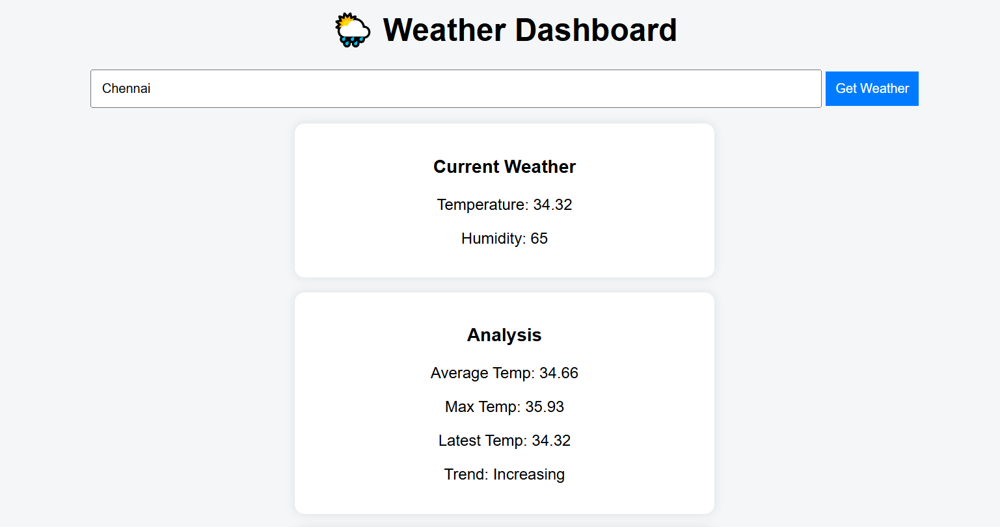
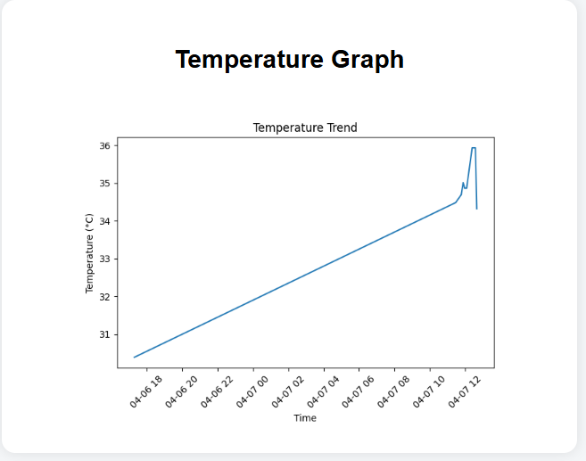
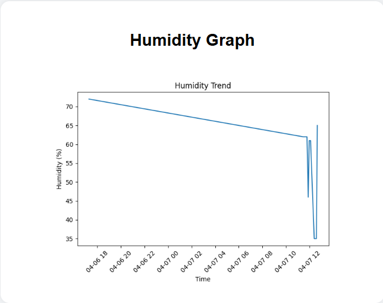

#  Weather Data Analyzer & Forecast Dashboard

##  Overview

This project is a Python-based Weather Data Analyzer that fetches
real-time weather data, stores historical records, analyzes trends,
predicts future temperature, and visualizes results using graphs. It
also includes a simple web dashboard built with Flask.

------------------------------------------------------------------------

##  Features

-    Fetch real-time weather data
-    Store data in CSV
-    Perform analysis (average, max, trend)
-    Graph visualization (temperature & humidity)
-    Predict future temperature
-    Web dashboard (Flask)

------------------------------------------------------------------------

##  Technologies Used

-   Python
-   Flask
-   Pandas
-   Matplotlib
-   Scikit-learn

------------------------------------------------------------------------

##  Project Structure

weather-analyzer/
│
├── app/                       
│   │
│   ├── api/                    
│   │   └── weather_api.py
│   │
│   ├── models/                
│   │   └── weather_model.py
│   │
│   ├── repository/          
│   │   └── weather_repo.py
│   │
│   ├── services/               
│   │   ├── weather_service.py      
│   │   ├── analysis_service.py     
│   │   ├── prediction_service.py     
│   │   └── visualization_service.py 
│   │
│   └── config.py              
│
├── data/                     
│   └── weather.csv
│
├── images/                     
│   ├── dashboard.png
│   ├── Temperature.png
│   └── Humidity.png
│
├── main.py                  
│
└── README.md               

------------------------------------------------------------------------

##  Screenshots

###  Dashboard UI

###  Temperature Graph

###  Humidity Graph

##  Author

Sibiya Jasemine M
